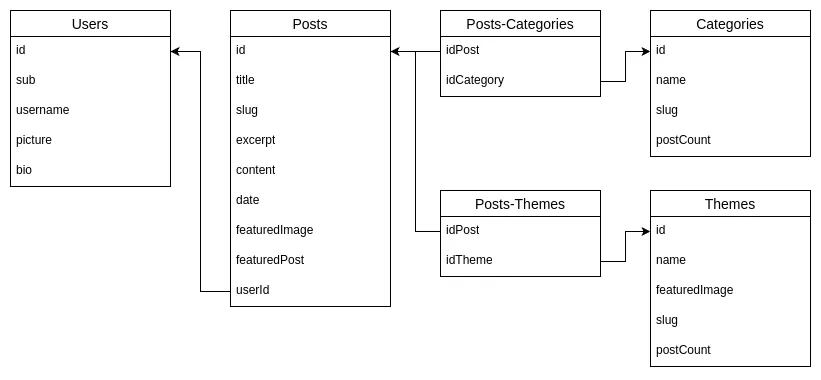

## DB Design

Next picture describe relationship between entities



In addition to relationships, the following considerations have been made

- `Users`
  ```java
  @OneToMany(mappedBy = "users", cascade = CascadeType.ALL, orphanRemoval = true)
  @JsonBackReference 
  @ToString.Exclude
    private Set<Post> posts;
  ```
  - `OrphanRemoval` and `CascadeType.ALL` together ensure that a user's associated posts are automatically deleted when the user is deleted.
  - `JsonBackReference` prevents infinite recursion when serializing the user object, as the user object would reference the posts, which would in turn reference the user, creating a circular dependency.

- `Posts`
  ```java
  @ManyToMany
  @JoinTable(
	  name = "posts_categories", 
	  joinColumns = @JoinColumn(name = "posts_id"), 
	  inverseJoinColumns = @JoinColumn(name = "categories_id")
	 )
  @JsonManagedReference
  private Set<Category> categories;
  ```
  - `ManyToMany` indicates a many-to-many relationship between the Post and Category entities.
  - `JoinTable` is used to stablish intermediate table on many-to-many relationships. `name` is the intermediate table name, `joinColumns` must refer to own table, id column, `inverseJoinColumns` must refer to the id of the table from the other part of the relationship
  - `JsonManagedReference` is used to avoid infinite recursion when serializing the Post and Category objects. It indicates that the Post object is the "owner" of the relationship and should be serialized first. The Category object will be serialized later, preventing circular references.

  ```java
  @ManyToOne
  @JoinColumn(name = "users_id")
  @JsonManagedReference
	private User users;
  ```
  - `JoinColumn` is used for many-to-one relationship and points to the id of the table that owns "many" of these entities. users is the User table name

- `Categories`
  ```java
  @ManyToMany(mappedBy = "categories")
  @JsonBackReference
  @ToString.Exclude
	private Set<Post> posts;
  ```
  - `ToString.Exclude` is used to not include this field on serialization of the entity. It's commonly used to prevent expose passwords

  ```java
  @PreRemove 
    private void onRemove() {
        for (Post post : posts) {
            post.getCategories().remove(this);
        }
    }
  ```
  - `PreRemove` executed a method before an entity is removed from database. It`s used to remove the reference to a category on associated posts if a category is deleted and avoid orphan remove which will delete posts associated.

  ```java
  @Transient
	private int postCount;
	
  @PostLoad
  @PostPersist
  @PostUpdate
	private void updatePostCount() {
		if (posts != null) {
			this.postCount = posts.size();
		} else {
			this.postCount = 0;
		}
	}
  ```
  - `Transient` indicates that postCount is not persisted on DB. It's a property that will be updated based on the function `updatePostCount` that is executed after JPA operations to update the count field based on size of `posts`
  - `PostLoad` called after an entity is loaded from the database
  - `PostPersist` called after an entity is saved on the database
  - `PostUpdate` called after an entity is updated in the database

- `Themes` with same considerations as Categories