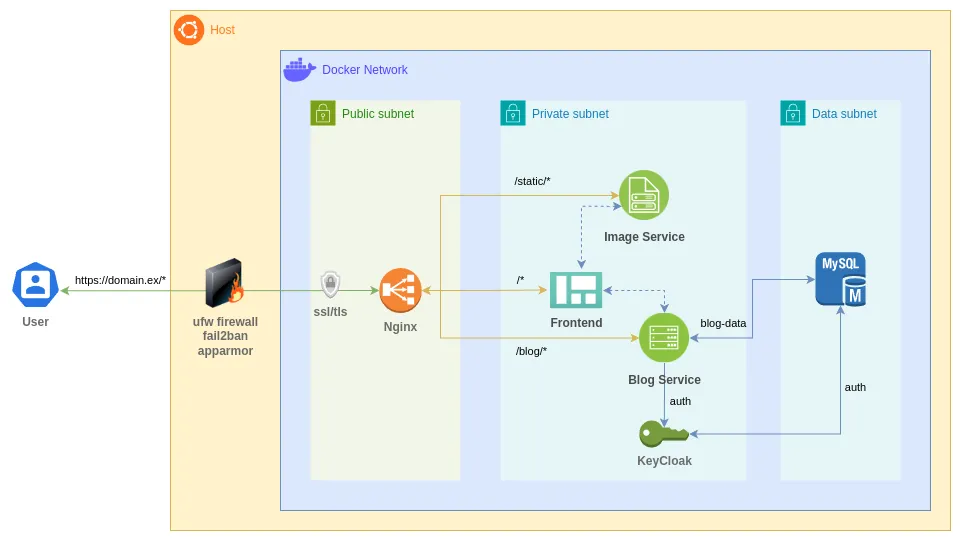

# System Design

Next picture describes proposed architecture to deploy the application

Application will be deployed using `docker compose` on `Ubuntu Server` VPS instance.

## Reverse Proxy

`Nginx` is used as unique entrypoint to the application. Main routes configured:

- `/` location to frontend
- `/blog` location to blog-service on backend (requests from frontend goes through proxy to the backend)
- `/static` location to file-service which provides media files

VPS will be publicly hosted on cloud provider so [lets encrypt](https://letsencrypt.org/es/) will be used with [certbot](https://certbot.eff.org/) to automatically download and update validated `ssl` certificates

## Frontend

Deployed with `React` using `Vite` tool and `Material UI` as component library. Provides the view for visitors. Home page with main blog entries, simple search engine to find posts according to category or keywords, pages to show available categories and themes and some admin tools to interact with blog data.

[More details on project setup and run here](../services/Frontend.md)

## Blog-Service

Deployed with `Springboot` using following libraries 

- OAuth with `Spring Security` and `jwt` using access and refresh token.
- Access to data using `Sping JPA`
- `Lombok` to simplify code by using annotations like `@AllArgsConstructor`, `@Getter`...

[More details on project setup and run here](../services/Blog-Service.md)

## File-Storage-Service

Using `Python` with `FastAPI` library which makes easy setup of basic server and stablish some middlewares trying to avoid `GET` spam requests to media files

[More details on project setup and run here](../services/File-Storage-Service.md)

## Auth-Service

Using `Keycloak` as identity server, allows to preload realm configurations so is not needed to manually register an user on first start. It's used combined with `blog-service` to protect private endpoints from the backend.

[More details on server setup and run here](../services/Auth-Service.md)

## MySQL Database

With `MySQL` as database, used by `blog-service` and `keycloak` to persist data on disk volume

[Database design and useful Spring model annotations to manage it](../design/DB-Design.md)

[More details on DB setup and run here](../services/MySQL.md)

## Host system

- `Ufw` as firewall which is an abstraction of `iptables`
- `fail2ban` as log scanner and ban system (uses `iptables` to deny IP)
- `AppArmor` that implements profiles for access control to host features